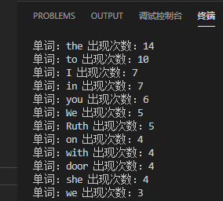

> 第 0004 题：任一个英文的纯文本文件，统计其中的单词出现的个数。
>
> 题目来源:https://github.com/Yixiaohan/show-me-the-code

## 题解

1. 读取文本文件
2. 正则表达式取单词
3. 列表元素统计以及排序

## 参考代码

```python
"""
第 0004 题：任一个英文的纯文本文件，统计其中的单词出现的个数。
"""
import re
from collections import Counter
with open('G:\\Python\\PythonWorkSpace\\Python练习册\\Python_Day_After_Day\\第005天-english_text.txt',encoding='utf-8') as f:
    # 读取文件
    content=f.read()
    # 取出英文单字列表
    words=re.findall(r'[a-zA-Z]+',content)
# 统计元素个数，即单词个数
summary_list = Counter(words)
# 排序
sort_list = sorted(summary_list.items(), key=lambda x: x[1], reverse=True)
# 打印单词与出现次数
for key, value in dict(sort_list).items():
    print('单词：{0} 出现次数：{1}'.format(key,value))
```

## 示例图片



## 代码仓库

[我的GitHub地址](https://github.com/tenli/Python_Day_After_Day):https://github.com/tenli/Python_Day_After_Day

## 寄语

种一棵树最好的时间是十年前,其次是现在。

那么,从现在开始,方圆十里的树归我种了。

## 需要学习的

1. 列表与字典操作
2. lambda表达式